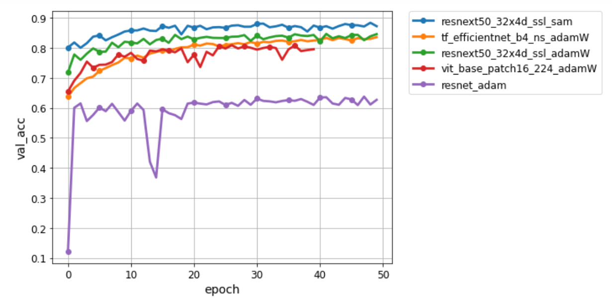

# Kaggle Cassava Leaf Disease Classification 2021

## 1. Installation

This project uses Haven-AI framework to manage and visualize the experiments. Haven-AI can be installed with

``` pip install --upgrade git+https://github.com/haven-ai/haven-ai```

## 2. Experiemnts

We have defined several experiment configurations on various models, optimizers and data augmentations, which can be found in exp_configs/. 

The resnet experiment can be run with the following command:

``` python -e resnet -d ../cassava_dataset -sb ../results -r 1```

where -d is the path of the dataset and -sb is the save directory.

## 3. Results

### 3.1 Launch Jupyter by running the following on terminal
``` 
jupyter nbextension enable --py widgetsnbextension --sys-prefix
jupyter notebook
```

### 3.2 On a Jupyter cell, run the following script

```python
from haven import haven_jupyter as hj
from haven import haven_results as hr
from haven import haven_utils as hu

# path to where the experiments got saved
savedir_base = 'results'

# path to exp_configs.py
exp_configs_fname = 'exp_config_fname'

exp_list = []
for exp_group in ['sam', 'efficientnet', 'resnext', 'vit', 'resnet']:
    exp_list += hu.load_py(exp_configs_fname).EXP_GROUPS[exp_group]
    
filterby_list = [{'model':{'name': 'resnext50_32x4d_ssl'}, 'loss_func':{'name': 'symmetric_cross_entropy', 'beta': 5.0, 'alpha':1}}, 
            {'opt':{'name': 'sam'}, 'train_transform':{'im_size': 475}},
             {'model':{'name': 'resnet'}},
             {'model':{'name': 'tf_efficientnet_b4_ns'}},
             {'model':{'name':'vit_base_patch16_224'}, 'train_transform':{'name': 'default'}},
            ]

rm = hr.ResultManager(exp_list=exp_list, 
                      savedir_base=savedir_base, 
                      filterby_list=None,
                      verbose=0,
                      exp_groups=None
                     )

# launch dashboard
# make sure you have 'widgetsnbextension' enabled; 
# otherwise see README.md in https://github.com/haven-ai/haven-ai
hj.get_dashboard(rm, vars(), wide_display=1, enable_datatables=1)
```

